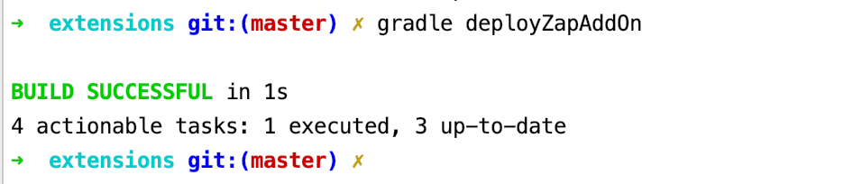

# README for zaproxy addOns

## Development

To deploy your plugin execute:

```bash
gradle deployZapAddOn
```

If you execute this in the main directory /extensions then all addOns will be deployed. If you run execute this in any of the subdirectories, only that particular plugin will be deployed.

## Writing new extensions

Right now, only one directory is available: the one for our first user story, the typosquat scanner. A main and test directory are available for us to place our classes and test cases in. For new user stories, extra directories will need to be created together with their own specific gradle task.

## Example passive scanner
The typosquatScanner directory now contains a dummy testclass and the example passive scanner class from the zap-extensions project. To add this extension in zaproxy, run the command above to deploy the addOn. Next you can start ZAP and load it.




