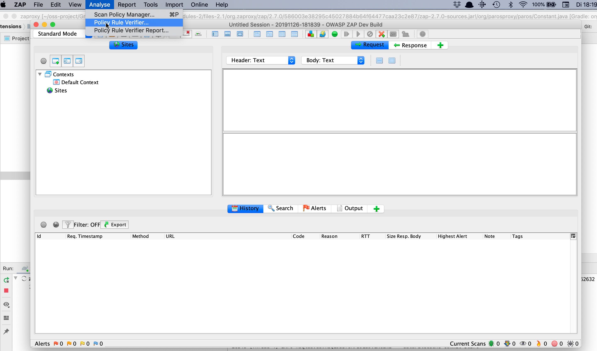
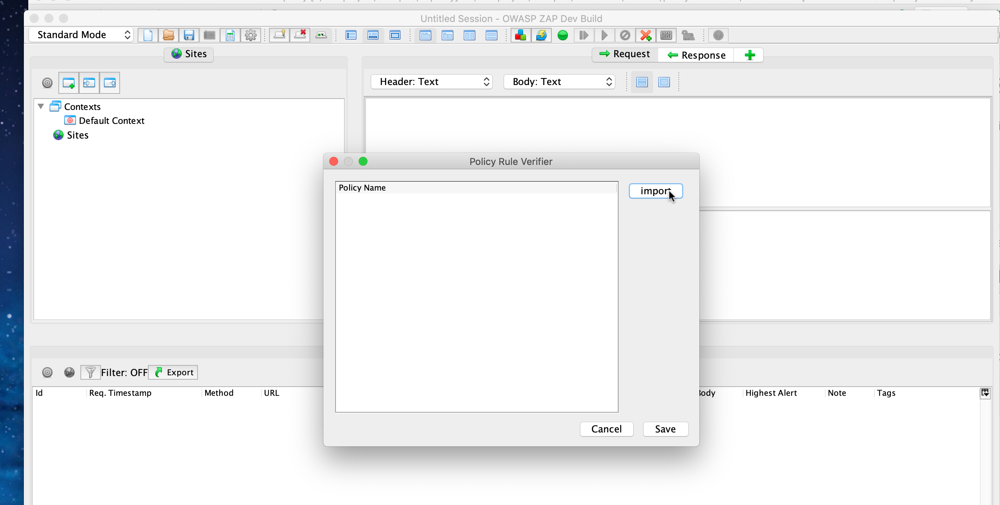
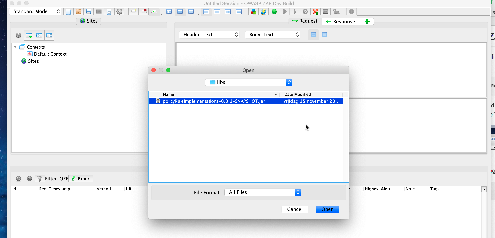
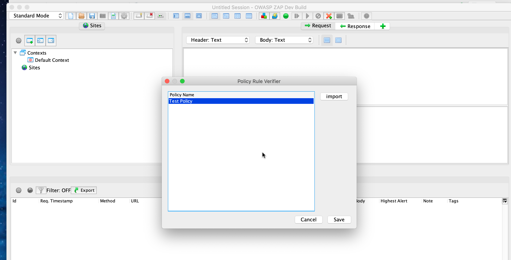
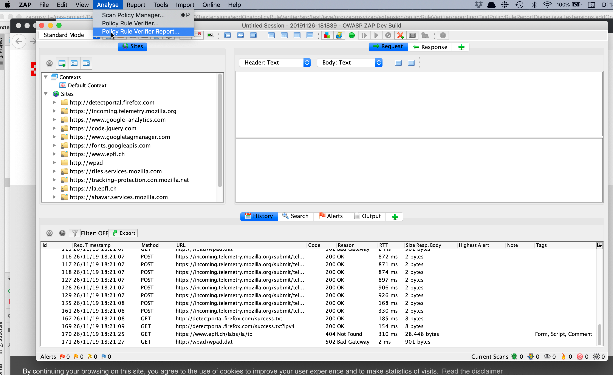
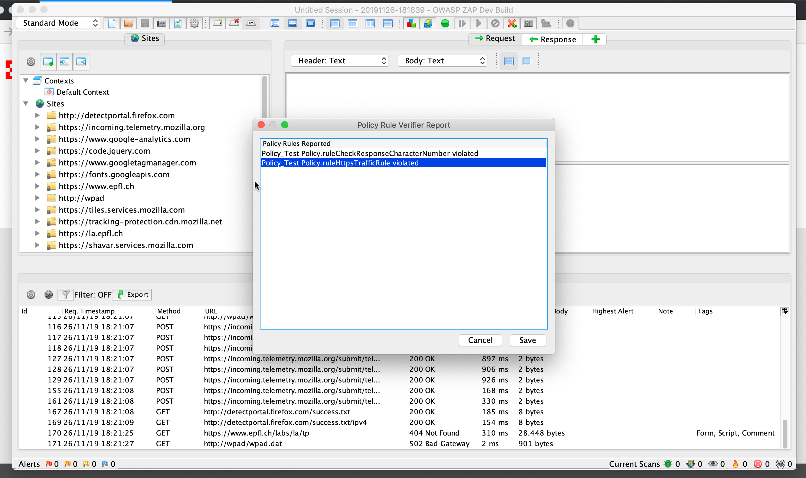

# How to load a Policy into ZAP

## Implement the interfaces
We have provided you with 2 interfaces to implement: a PolicyInterface and a RuleInterface. You can import these classes like this:
```java
/*
* import org.zaproxy.zap.extension.policyRuleVerifier.policies.AbstractPolicy;
  import org.zaproxy.zap.extension.policyRuleVerifier.policies.RuleInterface;
*/
```

You will need to implement the following methods in a class that extends the AbstractPolicy class:

```java
/*
* This method adds all the Rule implementations to the rules list in the AbstractPolicy class.
*/
Set<AbstractRule> setRules();

/*
* This method returns the name of the Policy
*/
String getName();
```

For each Rule (that should extend the AbstractRule class) in the Policy we expect the following methods to be implemented:

```java
/*
* This method returns true when the request of the HttpMessage satisfies the Rule.
* You will need the following HttpMessage: import org.parosproxy.paros.network.HttpMessage;
*/
boolean requestSatisfiesRule(HttpMessage msg);

/*
* This method returns true when the response of the HttpMessage satisfies the Rule.
* You will need the following HttpMessage: import org.parosproxy.paros.network.HttpMessage;
*/
boolean responseSatisfiesRule(HttpMessage msg);

/*
* This method returns the name of the Rule
*/
String getName();
```

Afterwards build your implementation into a .jar that can be loaded into Zaproxy.

## Load the .jar into Zaproxy

First deploy the Policy Rule Verifier extension by executing the following code from the "extensions" project directory:

```bash
gradle addOns:policyRuleVerifier:deployZapAddOn
```

Then start Zaproxy: you can load the .jar from the Analyse menu and then choose the Policy Rule Verifier... option.



This will open the following dialog from which you can then import your policy:



When you click the import button, a dialog will open that lets you load a .jar containing an implemented policy.

 

By clicking "open" your policy will be loaded and it will appear in the list of policies in the previous dialog:



If you wish to load multiple policies, just repeat the previous steps to load multiple .jar files.

## How to access the report in Zaproxy

In the same Analyse menu, right below the Policy Rule Verifier... option, you can access the Policy Rule Verifier Report...



This will open a dialog that shows you the policy and the rule that has been violated since the start of your session.

